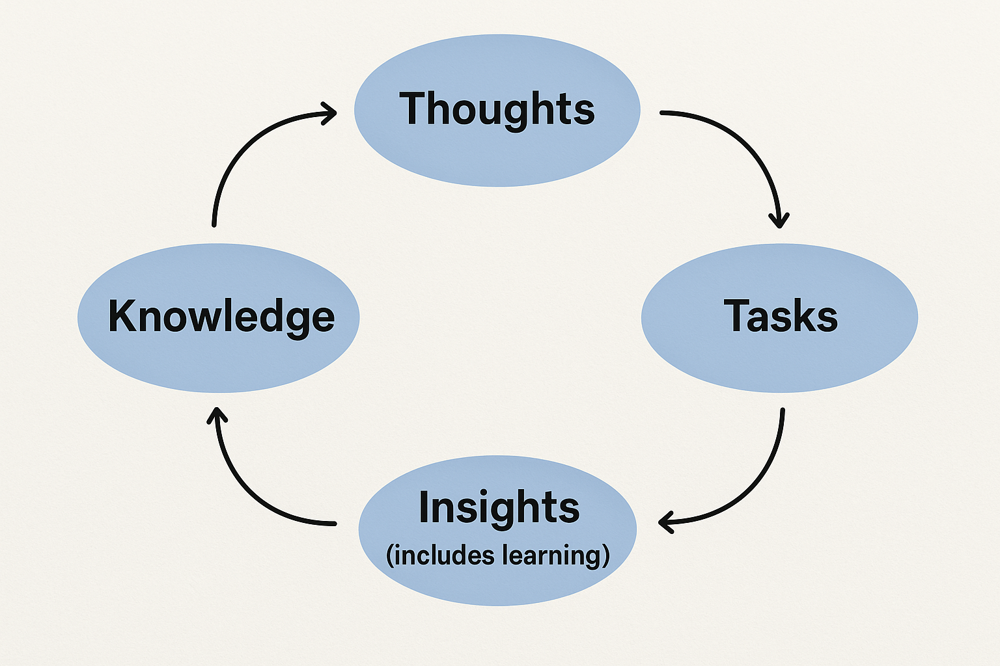

# PKM Assistant

A VSCode extension that adds interactive highlights to bullet points in markdown documents.

## TODO

- PKM front page UI
  - Page layout
    - [ ] List of latest edited files with links for quick navigation
      - And summaries of what was changed
    - [ ] Suggestions
      - [ ] Has a tooltip to "Accept all" (which should be undo-able)
      - [ ] List of all the visited, uncategorized websites and their visit times.
        - Intentions + timings + prerequisites e.g.
          - Intention: I want to learn about maths. Timing: When I have time. Prerequisites: calculus refresher.
          - Intention: I want to learn about new LLM architectures. Timing: Urgent. Prerequisites: learn about transformers.
        - Page summary
        - Project name
          - Editable
          - Marked as New or Updated
        - Section name
          - Editable
          - Marked as New or Updated
- Langchain workflow
  - [x] Write the project+section suggestions to the "Overview" document
    - [ ] Include a 'title' from the summarisation step and use for the link title

## TODO: project

- [x] Combine the browser_pkm folder with this extension?

## Thoughts

- PKM structure should generally be (top down)
  - Values
  - Abstract Knowledge / Concepts
  - Projects / Actionable Items
- We're building a knowledge-tasks-management system KTMS
  - The knowledge / task split is fundamental
  - This seems incredibly natural to me but it might be better to let this emerge naturally from the user's workflow preferences
  - "Thoughts" are another class (LOL). Maybe there are more...
    - BTW what are thoughts compared to knowledge and tasks?
      - 
        - Knowledge -> Thoughts -> Tasks
        - Tasks -> Insights (includes learning) -> Knowledge
        - Thoughts -> Tasks:
          - A thought might be quite abstract and not actionable.
          - It's a proposed insight / hypothesis about the (local) knowledge.
          - But it then sometimes fits into and manifests in the task tree
- Local vs universal knowledge
  - knowledge is relative to system it is in. Knowledge is the description of (part of) a system.