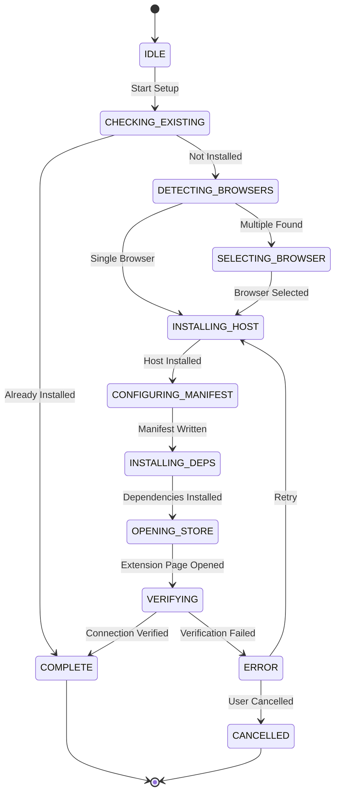

# Browser Integration Automated Setup - Implementation Plan

## Executive Summary

This document outlines the comprehensive plan for implementing automated browser integration setup for the Bergamot VS Code extension, eliminating the current manual, error-prone installation process.

## Problem Statement

Current setup requires users to:
- Manually run shell scripts
- Edit configuration files
- Install Python dependencies via command line
- Build browser extensions from source
- Navigate platform-specific installation paths

This results in:
- High user friction and abandonment
- Frequent support requests
- Platform-specific issues
- Poor error recovery

## Critical Constraints

**No OS-Level Publisher Registration:**
- No Apple Developer Program ($99/year) for code signing
- No Microsoft code signing certificates
- Native host remains unsigned

**Extension Store Publishing IS Acceptable:**
- ✅ Chrome Web Store ($5 one-time) - OK
- ✅ Firefox Add-ons (free) - OK  
- ✅ VS Code Marketplace (free) - OK
- ✅ Edge Add-ons (free) - OK

This means:
- Browser extensions distributed through official stores (much better UX!)
- VS Code extension on marketplace
- Only native host Python script remains unsigned
- Users only need to accept security warnings for native host

## Solution Architecture

### Design Patterns Selected

After extensive research, we've selected a hybrid approach combining:

1. **Wizard Pattern** - Progressive disclosure with clear steps
2. **Strategy Pattern** - Platform/browser-specific handling
3. **State Machine** - Robust state management and error recovery
4. **Event-Driven Architecture** - Progress updates and decoupled components

### Core Components

```
┌─────────────────────────────────────────┐
│         Setup Orchestrator              │
├─────────────────────────────────────────┤
│  ┌───────────┐  ┌──────────────────┐   │
│  │   State   │  │     Browser      │   │
│  │  Machine  │  │    Detector      │   │
│  └───────────┘  └──────────────────┘   │
│  ┌───────────┐  ┌──────────────────┐   │
│  │  Platform │  │   Setup Wizard   │   │
│  │ Installer │  │       (UI)       │   │
│  └───────────┘  └──────────────────┘   │
│  ┌───────────────────────────────────┐ │
│  │    Connection Verifier            │ │
│  └───────────────────────────────────┘ │
└─────────────────────────────────────────┘
```

#### 1. Setup Orchestrator
- Main controller coordinating all components
- Manages overall flow and error handling
- Provides unified API for the setup process

#### 2. State Machine
- Tracks installation progress
- Enables resumption after failures
- Provides rollback capabilities
- States: IDLE → DETECTING → INSTALLING → CONFIGURING → VERIFYING → COMPLETE

#### 3. Browser Detector
- Auto-detects installed browsers (Chrome, Firefox, Edge, Brave, Opera)
- Identifies default browser
- Discovers installation and profile paths
- Checks native messaging support

#### 4. Platform Installers
- **macOS**: `~/Library/Application Support/` paths
- **Linux**: `~/.config/` and `~/.mozilla/` paths
- **Windows**: Registry-based installation (simplified initially)

#### 5. Setup Wizard UI
- Modal dialogs with clear instructions
- Progress notifications with cancellation
- Error messages with actionable solutions
- Success confirmation with next steps

#### 6. Connection Verifier
- Tests native host installation
- Validates manifest configuration
- Performs end-to-end message round-trip
- Health check API

## Implementation Phases

### Phase 1: Foundation (Week 1)
- Create project structure
- Implement state machine
- Build browser detection
- Basic error handling

### Phase 2: Platform Support (Week 2)
- macOS installer
- Linux installer
- Windows installer (basic)
- Manifest generation

### Phase 3: User Experience (Week 3)
- Setup wizard UI
- Progress reporting
- First-run detection
- Error recovery flows

### Phase 4: Integration & Testing (Week 4)
- Connection verification
- E2E testing
- Documentation
- Beta release

## Browser Extension Installation Strategy

### Using Official Extension Stores

Since we'll publish to official stores, installation becomes much simpler:

#### Chrome Web Store
1. **One-Click Installation**
   - VS Code opens Chrome Web Store page
   - User clicks "Add to Chrome"
   - Extension ID is fixed and known
   - No developer mode required
   - Automatic updates through store

2. **Post-Installation**
   - Extension automatically connects to native host
   - VS Code detects successful installation
   - Connection verified automatically

#### Firefox Add-ons
1. **Standard Installation**
   - VS Code opens addons.mozilla.org page
   - User clicks "Add to Firefox"
   - Signed extension, no warnings
   - Automatic updates

#### Microsoft Edge
1. **Edge Add-ons Store**
   - Can submit same Chrome extension
   - Native Edge store integration
   - Or install from Chrome Web Store

#### Fallback: Local Installation
- For development/testing only
- Bundle extension with VS Code for offline scenarios
- Guide through developer mode if needed

### Native Host Security Warnings

#### macOS Gatekeeper
```typescript
// Show instructions when Gatekeeper blocks
async function handleMacOSGatekeeper() {
  const instructions = `
    macOS blocked the native host because it's not signed.
    
    To allow it:
    1. Open Finder → Go to ~/.bergamot/
    2. Right-click on 'native_host.py'
    3. Select "Open" from the menu
    4. Click "Open" in the dialog
    
    [Show Me How] [I Did It] [Cancel]
  `;
  
  const result = await vscode.window.showWarningMessage(
    instructions,
    { modal: true },
    'Show Me How',
    'I Did It',
    'Cancel'
  );
}
```

#### Windows SmartScreen
- Similar approach with "More info" → "Run anyway"
- PowerShell execution policy bypass instructions
- Consider bundling as .exe with PyInstaller (still unsigned but fewer warnings)

## Technical Specifications

### File Structure
```
vscode/src/browser_integration/
├── index.ts                    # Public API
├── setup_orchestrator.ts       # Main controller
├── state_machine.ts           # State management
├── browser_detector.ts        # Browser detection
├── setup_wizard.ts           # UI components
├── connection_verifier.ts    # Validation
├── installers/
│   ├── base_installer.ts     # Abstract base
│   ├── macos_installer.ts    # macOS implementation
│   ├── linux_installer.ts    # Linux implementation
│   └── windows_installer.ts  # Windows implementation
├── strategies/
│   ├── chrome_strategy.ts    # Chrome-specific
│   ├── firefox_strategy.ts   # Firefox-specific
│   └── edge_strategy.ts      # Edge-specific
├── models/
│   ├── browser_info.ts       # Data models
│   ├── setup_config.ts       # Configuration
│   └── setup_result.ts       # Results
├── utils/
│   ├── platform_utils.ts     # OS utilities
│   ├── file_utils.ts         # File operations
│   └── process_utils.ts      # Process management
└── resources/
    ├── native_host.py         # Bundled native host
    └── manifest_templates/    # Manifest templates
```

### API Design

```typescript
// Public API
export class BrowserIntegrationSetup {
  static async checkInstallation(): Promise<InstallationStatus>;
  static async runSetup(context: vscode.ExtensionContext): Promise<SetupResult>;
  static async repair(): Promise<RepairResult>;
  static async uninstall(): Promise<void>;
}

// Usage in extension.ts
export async function activate(context: vscode.ExtensionContext) {
  const status = await BrowserIntegrationSetup.checkInstallation();
  
  if (!status.isComplete) {
    const result = await vscode.window.showInformationMessage(
      'Set up browser integration for webpage tracking?',
      'Setup Now',
      'Later'
    );
    
    if (result === 'Setup Now') {
      await BrowserIntegrationSetup.runSetup(context);
    }
  }
}
```

### State Transitions



## Success Criteria

### Functional Requirements
- ✅ One-click setup from VS Code
- ✅ Automatic browser detection
- ✅ Native host installation without terminal
- ✅ Manifest generation with correct paths
- ✅ Python dependency installation
- ✅ **Browser extension store integration (Chrome/Firefox/Edge)**
- ✅ Connection verification
- ✅ Error recovery
- ✅ **Security warning guidance (native host only)**

### Non-Functional Requirements
- Setup completion > 90% success rate
- Average setup time < 30 seconds
- Works on macOS, Linux, Windows
- Clear error messages
- Resumable after failures
- No manual file editing

### User Experience Goals
- Zero terminal/command line usage
- Clear progress indicators
- Helpful error messages
- Seamless first-run experience
- One-click recovery from errors

## Risk Analysis

| Risk | Impact | Mitigation |
|------|--------|------------|
| Python not installed | High | Provide download link, consider Node.js fallback |
| Permission denied | Medium | Clear instructions, elevation prompt |
| Browser incompatibility | Medium | Start with Chrome/Firefox, expand later |
| Windows complexity | High | Simplified approach initially |
| Extension store delays | Low | Local installation option |

## Testing Strategy

### Unit Tests
- State machine transitions
- Browser detection logic
- Platform installer methods
- Error handling

### Integration Tests
- Full setup flow per platform
- Error recovery scenarios
- Connection verification

### Manual Testing
- Fresh installation
- Upgrade scenarios
- Error conditions
- Different browser combinations

## Rollout Plan

1. **Alpha Release**: Internal testing with team
2. **Beta Release**: Limited release to volunteers
3. **Staged Rollout**: 10% → 50% → 100% over 2 weeks
4. **Monitoring**: Track success rates and errors
5. **Iteration**: Quick fixes based on feedback

## Metrics & Monitoring

### Key Metrics
- Setup initiation rate
- Setup completion rate
- Error rates by type
- Time to complete setup
- Retry success rate

### Telemetry Events
- `setup.started`
- `setup.browser_detected`
- `setup.host_installed`
- `setup.completed`
- `setup.error`
- `setup.cancelled`

## Future Enhancements

### Phase 2 Features
- Multi-browser support (simultaneous)
- Cloud sync of settings
- Automatic updates
- Advanced Windows registry support
- Brave and Opera support

### Phase 3 Features
- Node.js native host alternative
- WebExtension manifest v3 support
- Safari support (macOS)
- Enterprise deployment tools

## Conclusion

This automated setup system will transform the user experience from a complex, error-prone manual process to a seamless one-click installation. By following established design patterns and implementing robust error handling, we can achieve >90% setup success rate while reducing support burden.

The phased approach allows us to deliver value quickly while maintaining quality and expanding platform support over time.